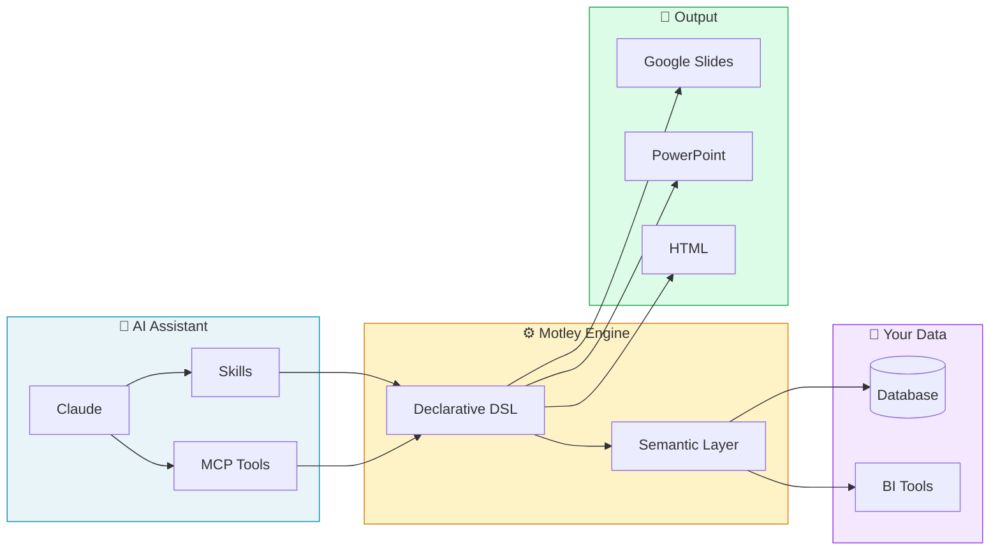
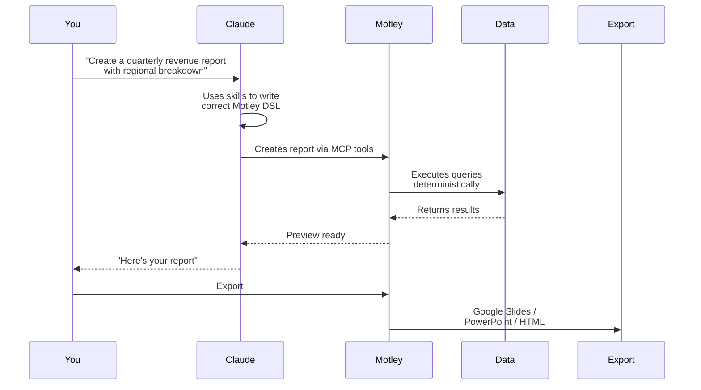

# Motley Agent Skills & MCP Server

**Build data-driven reports and presentations with AI — without sacrificing accuracy or control.**

This package provides Claude with the skills and tools to create professional reports using [Motley](https://motley.ai), where generative AI meets deterministic, auditable data pipelines.

---

## What is Motley?

Motley enables **number-intensive reporting that combines the ease of use of Generative AI with the robustness and transparency of deterministic configs**.

Instead of hoping your AI gets the numbers right, Motley gives you:

- **A declarative DSL** for charts, tables, queries, and data-driven text — with powerful expressions and cross-references between elements
- **A flexible semantic layer** for business-relevant queries (use ours, import from your BI tool, or bring your own)
- **Tightly controlled LLM calls** for text generation that cite their sources and respect your data
- **Export anywhere** — Google Slides, PowerPoint, and HTML while preserving your original styling
- **Full MCP integration** so your AI assistant can create and manipulate everything programmatically

The result: reports that are both AI-assisted *and* trustworthy.

---

## What's in This Package?

### Skills

Domain knowledge that helps Claude understand Motley's MCP tools and build data-driven presentations:

| Skill | What it does |
|-------|--------------|
| [`master-builder`](docs/skills.md#master-builder) | End-to-end workflow for creating a data-driven master |
| [`update-chart`](docs/skills.md#update-chart) | Create bar, line, pie, and funnel charts via natural language prompts |
| [`update-text-block`](docs/skills.md#update-text-block) | Generate data-driven text with variable substitution and optional LLM enhancement |
| [`update-table-block`](docs/skills.md#update-table-block) | Build formatted tables with size constraints and flexible layouts |
| [`update-query-block`](docs/skills.md#update-query-block) | Create data queries for text and table blocks |
| [`explore-model`](docs/skills.md#explore-model) | Explore models, inspect schemas, create custom models/measures |
| [`layout-library-sync`](docs/skills.md#layout-library-sync) | Import Google Slides and sync content from reference masters |

### MCP Server

A complete set of tools for Claude to interact with Motley programmatically:

- [**Model tools**](docs/tools/model.md) — explore and create models, add measures and dimensions
- [**Outline tools**](docs/tools/outline.md) — plan deck structure with outline sessions
- [**Layout tools**](docs/tools/layout.md) — browse templates, get thumbnails, create masters
- [**Master tools**](docs/tools/master.md) — inspect structure, variables, copy/move/delete slides
- [**Element tools**](docs/tools/element.md) — create and edit charts, tables, text blocks, queries

---

## Quick Start

### Option 1: Skills Only (via skills.sh)

```bash
npx skills add MotleyAI/agent-skills -a claude-code
```

### Option 2: Claude Desktop Extension

Download the `.mcpb` file from [Releases](https://github.com/MotleyAI/agent-skills/releases) and drag it into Claude Desktop.

### Option 3: Claude Code with MCP

```bash
export MOTLEY_API_KEY="sk_your_key_here"
claude --plugin-dir /path/to/agent-skills
```

See [docs/setup.md](docs/setup.md) for detailed instructions.

---

## How It Works



### The Flow



**Every number is traceable. Every chart is reproducible. Every report is auditable.**

---

## Documentation

- [Setup Guide](docs/setup.md) — Installation and configuration
- [Skills Reference](docs/skills.md) — Domain knowledge for queries, charts, text, and tables
- [MCP Tools Reference](docs/tools.md) — All 35 MCP tools with detailed argument documentation

---

## Learn More

- **Website:** [motley.ai](https://motley.ai)
- **Questions?** Open an issue or [book a demo](https://motley.ai/book-a-demo)

---

## License

MIT
